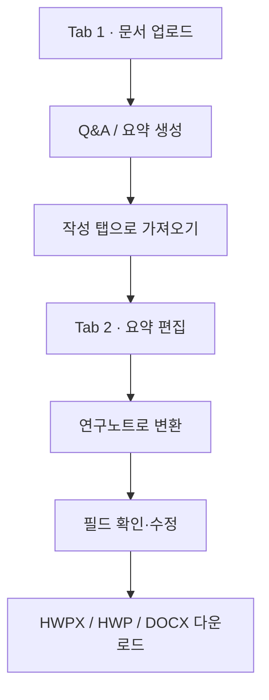

# Document Analyser

HWP/Docs/txt/PY/PDF/Excel 등 다양한 형식의 문서 통합 분석·요약과 **연구노트 생성** 및 저장


## 설치 및 실행

```bash
cd /home/eunbi/Document_Analyser
pip install -r requirements.txt
PORT=8503 ./run_app.sh
```

브라우저: [http://127.0.0.1:8503](http://127.0.0.1:8503)

## 탭 구성

### 1. 문서 분석 및 요약

- Q&A, 다형식 업로드: HWP/HWPX/PDF/TXT/PY/XLSX/XLS/CSV
- **연구노트용 통합 요약** 생성·편집
- **작성 탭으로 가져오기** — Tab 2로 요약 전달
- **마지막 Q&A 답변 → 작성 탭으로** — 채팅 답변을 바로 Tab 2에 넣기

### 2. 연구노트 작성 및 문서 생성

- 요약문 편집, 연구노트 **표 미리보기**
- **연구노트로 변환** (요약 → 폼 `내용` 칸)
- 주제 / 책임자 / 일시 / 작성자 / 내용 / 연구결과 / 기타내용 입력
- **HWPX / HWP / DOCX** 다운로드

### HWP 템플릿

- 경로: `templates/Note_Template.hwp`
- 한글에서 만든 연구노트 양식. 라벨(주제, 책임자, 일시, 작성자, 내용, 연구결과, 기타내용) 바로 다음 칸에 값이 채워집니다.
- 템플릿을 바꿀 때는 **라벨 문구만 유지**하면 코드 수정 없이 동작합니다.

## 사용 흐름




## 폴더 구조

```
Document_Analyser/
├── app.py                      # Streamlit 진입점
├── run_app.sh
├── requirements.txt
├── tabs/
│   ├── intelligence_tab.py     # Tab 1 (Product A + 요약)
│   └── writer_tab.py           # Tab 2 (연구노트 폼·다운로드)
├── services/
│   ├── document_parser.py      # 업로드 파싱
│   ├── summarizer.py           # 요약·키워드
│   ├── session_bridge.py       # Tab 1 → Tab 2 데이터 전달
│   ├── text_hwpx_builder.py    # HWPX/HWP/DOCX 생성
│   └── _hwp_path.py            # HWP analysis 경로 설정
└── templates/                  # HWP 다운로드용 템플릿

```

